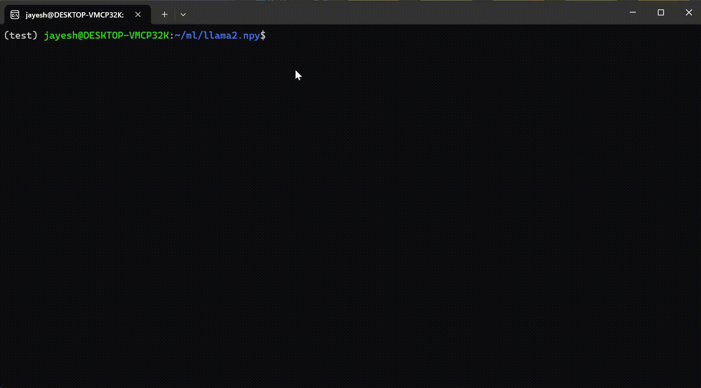

# llama2.npy

`llama2.npy` is a Python+[Numpy](https://numpy.org/doc/stable/index.html) port of [llama2.c](https://github.com/karpathy/llama2.c) by Andrej Karpathy. It includes an implementation of the baby LLama2 architecture trained on [TinyStories](https://huggingface.co/datasets/roneneldan/TinyStories) and the accompanying tokenizer all using just Python and Numpy. The model weights and tokenizer scores are also from Andrej Karpathy.

This repo is a companion to my blog: [llama2.npy : Implementing Llama2 LLM using just Python and Numpy](https://jayeshmahapatra.github.io/2023/12/03/llama2.html)

<figure>
    
    <figcaption>Generating text from the baby LLama2 model</figcaption>
</figure>

## Usage

#### 1. Clone the repository.
To get started, clone this repository to your local machine using the following command:
```
git clone https://github.com/jayeshmahapatra/llama2.npy
```

### 2. Install Numpy
Make sure you have Numpy installed. You can install a specific version (1.23.5) with the following command:
```
pip install numpy==1.23.5
```

### 3. Run the Model Using the Command Line
You can generate text using the LLama2 model by running the following command in your terminal:
```
python run_npy.py -i "Once upon a time" -w weights/stories15M.bin -n 20
```
Here's an explanation of the command line arguments for `run_npy`:

- `-i` or `--input`: Specify the input prompt for text generation. By default, it is set to "Once upon a time."

- `-n` or `--num_tokens`: Define the number of tokens you want the model to generate. The default value is 20.

- `-w` or `--weight`: Provide the path to the binary file containing the model weights. This argument is required for the model to work properly.